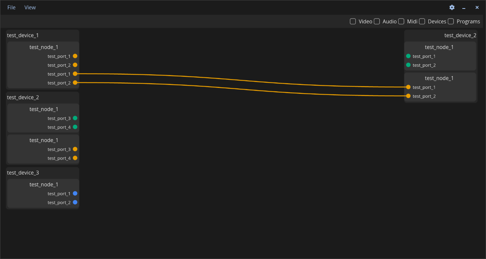

# Switchbox

A modern media routing application for [PipeWire](https://pipewire.org/) built with [libcosmic](https://github.com/pop-os/libcosmic).

Switchbox provides an intuitive graphical interface for managing audio, video, and MIDI connections between PipeWire nodes — with the goal of surpassing existing tools.




## Features (WIP)

- Visual patchbay for PipeWire source and sink connections
- Color-coded ports by media type (Audio, Video, MIDI)
- Filterable view by media type and device class
- Node inspector with detailed information and internal routing
- Bezier curve link visualization on a canvas layer
- Hover and selection highlighting
- COSMIC desktop integration (context drawers, theming, localization)

## Roadmap

| Version | Focus |
|---------|-------|
| **v1.0** | Non-persistent media routing; applet functionality (system tray, launch at start, right-click menu) |
| **v2.0** | Advanced and persistent audio routing via inspector and busses, that remembers connected devices |
| **v3.0** | Audio plugin support (CLAP, VST3, LV2) |
| **v4.0** | Advanced MIDI/Video routing; internal controller routing |

## Installation

A [justfile](./justfile) is included by default for the [casey/just][just] command runner.

- `just` builds the application with the default `just build-release` recipe
- `just run` builds and runs the application
- `just install` installs the project into the system
- `just vendor` creates a vendored tarball
- `just build-vendored` compiles with vendored dependencies from that tarball
- `just check` runs clippy on the project to check for linter warnings
- `just check-json` can be used by IDEs that support LSP

## Translators

[Fluent][fluent] is used for localization of the software. Fluent's translation files are found in the [i18n directory](./i18n). New translations may copy the [English (en) localization](./i18n/en) of the project, rename `en` to the desired [ISO 639-1 language code][iso-codes], and then translations can be provided for each [message identifier][fluent-guide]. If no translation is necessary, the message may be omitted.

## Packaging

If packaging for a Linux distribution, vendor dependencies locally with the `vendor` rule, and build with the vendored sources using the `build-vendored` rule. When installing files, use the `rootdir` and `prefix` variables to change installation paths.

```sh
just vendor
just build-vendored
just rootdir=debian/switchbox prefix=/usr install
```

It is recommended to build a source tarball with the vendored dependencies, which can typically be done by running `just vendor` on the host system before it enters the build environment.

## Developers

Developers should install [rustup][rustup] and configure their editor to use [rust-analyzer][rust-analyzer]. To improve compilation times, disable LTO in the release profile, install the [mold][mold] linker, and configure [sccache][sccache] for use with Rust. The [mold][mold] linker will only improve link times if LTO is disabled.

[fluent]: https://projectfluent.org/
[fluent-guide]: https://projectfluent.org/fluent/guide/hello.html
[iso-codes]: https://en.wikipedia.org/wiki/List_of_ISO_639-1_codes
[just]: https://github.com/casey/just
[rustup]: https://rustup.rs/
[rust-analyzer]: https://rust-analyzer.github.io/
[mold]: https://github.com/rui314/mold
[sccache]: https://github.com/mozilla/sccache

## License

This project is licensed under the [Mozilla Public License 2.0 (MPL-2.0)](https://www.mozilla.org/en-US/MPL/2.0/).
